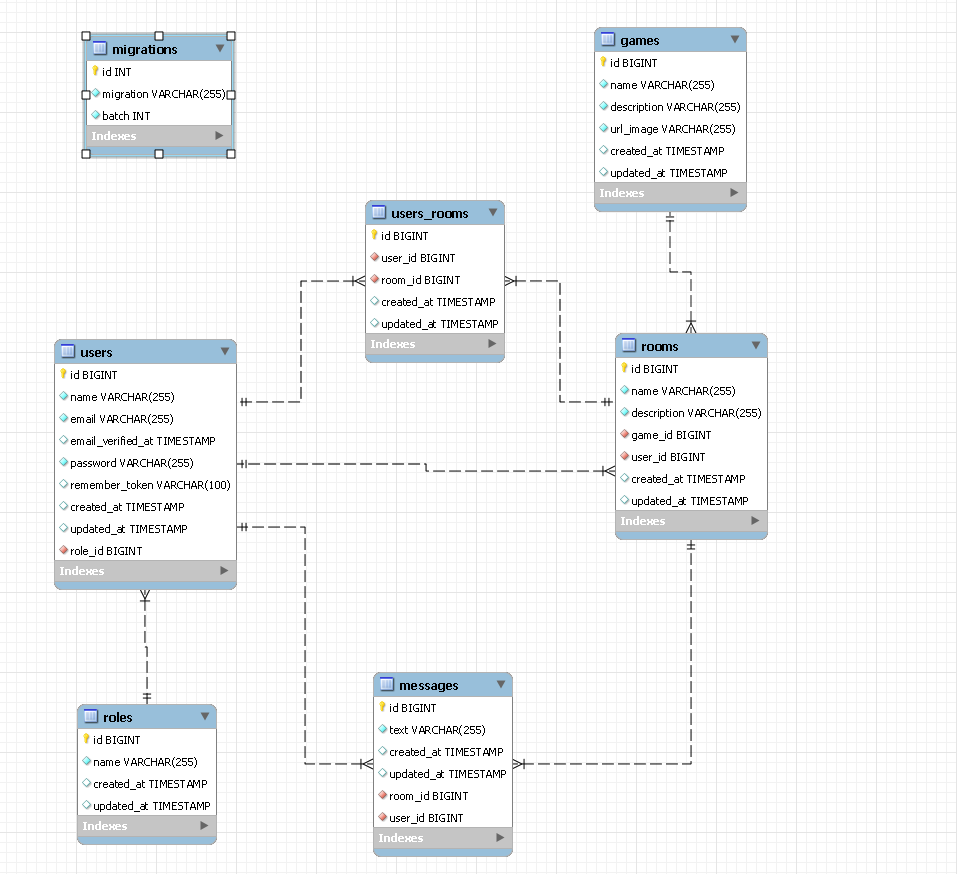

### Laravel Backend web LFG  🎮 🕹️


### Index 📚

<details>
  <summary> Content 📝</summary>
  <ol>
    <li><a href="#about-the-project">About the project</a></li>
    <li><a href="#local-installation">Local installation</a></li>
    <li><a href="#stack">Stack</a></li>
    <li><a href="#database-diagram">Database Design</a></li>
    <li><a href="#endpoints">Endpoints</a></li>
    <li><a href="#Future-features">Future features</a></li>
    <li><a href="#authors">Authors</a></li>
  </ol>
</details>

### About the project 
<p>The first team project proposed by GeeksHubs Academy in the PHP and Laravel section aims to develop a Looking For Group web application to improve and promote social interaction among employees of a company. Users will be able to register, log in, and also create or search for groups for each video game to play after work. In addition to all this, they will be able to manage their profile, including details such as their Steam username, and log out whenever they want.</p>

### Local installation 

1. If you don't have MySQL installed on you computer, you can install Docker and execute the above command on your Powershell to create a MySQL container
` $ docker run --name container-name -p 3307:3306 -e MYSQL_ROOT_PASSWORD=1234 -d mysql `
2. Clone the repository
` $ git clone https://github.com/FRR95/laravel-api-project.git `
3. Install dependencies
  `$ composer install`
2. Migrations
    `$ php artisan migrate`
3. Seeders
    `$ php artisan db:seed`

You will need to rename the ".env.sample" to ".env". That .env.sample matches the MySQL credentials on the Docker we put as example.


### Stack 
Technologies used:
<div align="center">
<a href="https://www.mysql.com/">
    
</a>
<a href="https://www.php.net/">
    
</a>
<a href="https://laravel.com/">
    
</a>
<a href="https://getcomposer.org/">
    
</a>
  <a href="https://git-scm.com/">
    
</a>
  <a href="https://www.postman.com/">
    
</a>
</div>

### Database Design 



### Endpoints 
<details>
<summary>Details</summary>

- Auth
    - Register:

            POST http://localhost:8000/api/register
        
        body:


        ``` json
            {
                "name": "Javi",
                "email": "javi@javi.com",
                "password": "1234"
            }
        ```


    - Log in

            POST http://localhost:8000/api/login 
        
        body:


        ``` json
            {
                "email": "javi@javi.com",
                "password": "1234"
            }
        ```

- Users
    - PUT: update profile
    http://localhost:8000/api/me

    ```sh
    {
        "name":"[your name here]"
    }
    ```

    - DELETE: logout
    http://localhost:8000/api/logout


- Games
    - GET: get all games
    http://localhost:8000/api/games

    - POST: create game
    http://localhost:8000/api/games

    ```sh
    {
        "name": "[your name here]",
        "description": "[description here]",
        "url_image": "[url here]"
    }
    ```

    - PUT: update game by Id
    http://localhost:8000/api/games/{id}

    ```sh
    {
        "name": "[your name here]",
        "description": "[description here]",
        "url_image": "[url here]"
    }
    ```
    The {id} in the endpoint targets a game_id. In the body you have to put only the fields you want to update.

    - DELETE: delete game by Id
    http://localhost:8000/api/games/{id}

- Rooms
    - GET: get all rooms
    http://localhost:8000/api/rooms 

    - GET: get all rooms by game
    http://localhost:8000/api/rooms/{gameName} 

    In the url we put the name of the game we are searching for. It will retrieve all the rooms that has that game as main theme.

    - POST: create new room
    http://localhost:8000/api/rooms 


    ```sh
    {
        "name": "[your name here]",
        "description": "[description here]",
        "game_id": "[url here]"
    }
    ```

    - PUT: update room
    http://localhost:8000/api/rooms/{id}


    ```sh
    {
        "name": "[your name here]",
        "description": "[description here]"
    }
    ```

    You can update either the name, the description or both. You only need to send in the body the fields you want to update.

    - DELETE: delete room
    http://localhost:8000/api/rooms/{id}

- User Rooms
    - GET: get all users from room id
    http://localhost:8000/api/userroom/{id}

    You have to put the id of the room you want to see in the url. It will retrieve all the names of the users that are in that room.

    - POST: join room
    http://localhost:8000/api/userroom

    ```sh
    {
        "room_id": [number here]
    }
    ```

    It will add to the intermediate table the room you pass through the body and the user_id of the token.

    - DELETE: leaver room by Id
    http://localhost:8000/api/userroom/{id}

    You have to pass the id of the room you want to leave in the url.

- Messages
   - POST: create message
    http://localhost:8000/api/message


    ```sh
    {
        "text": "[your text here]",
        "room_id": [room number],
    }
    ```

  - GET: get all messages from room by id
    http://localhost:8000/api/messages/room/{id}

    You have to put the room id in the url and it will retrieve all the messages of that room.

  - PUT: update message by Id
    http://localhost:8000/api/messages/{id}


    ```sh
    {
        "text": "[your text here]"
    }
    ```
 
  - DELETE: delete message by Id
    http://localhost:8000/api/messages/{id}
 

</details>

### Future features 

 ✅Events and tournaments
 ✅Achievement System


### Authors 
Javi 😼

<a href="https://github.com/Javi-Gallego" target="_blank"></a>
</p>
<p>
Jesus 😸

<a href="https://github.com/JesusMatinezClavel" target="_blank"></a>
</p>
<p>
Fran 🙀

<a href="https://github.com/FRR95" target="_blank"></a>
</p>
<p>
Paula 😿

<a href="https://github.com/almela09" target="_blank"></a>
</p>
<p>


